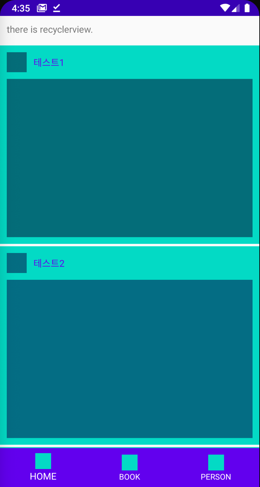

# 2nd Seminar Work

> 필수과제 2
* clipToPadding
  * false로 설정 시 리스트뷰, 리사이클러뷰 아이템 내부에 패딩 적용
  * xml 또는 code 내부에서 설정 가능

* itemDecoration
  * RecyclerView 아이템의 상태를 데코해주는 클래스
  * 아이템 간 divider 또는 여백 설정에 주로 사용
  * 익명 클래스를 생성해서 마지막 position이 아닐경우 bottom에 divider 10 pixel 적용
  <pre>
  <cdoe>
  addItemDecoration(object: RecyclerView.ItemDecoration() {
                override fun getItemOffsets(
                    outRect: Rect,
                    view: View,
                    parent: RecyclerView,
                    state: RecyclerView.State
                ) {
                    super.getItemOffsets(outRect, view, parent, state)
                    if (parent.getChildAdapterPosition(view) != (parent.adapter?.itemCount?.minus(1)))
                        outRect.bottom = 10
                }
            })
   </pre>
   </code>

> 스크린샷(과제1,2)

